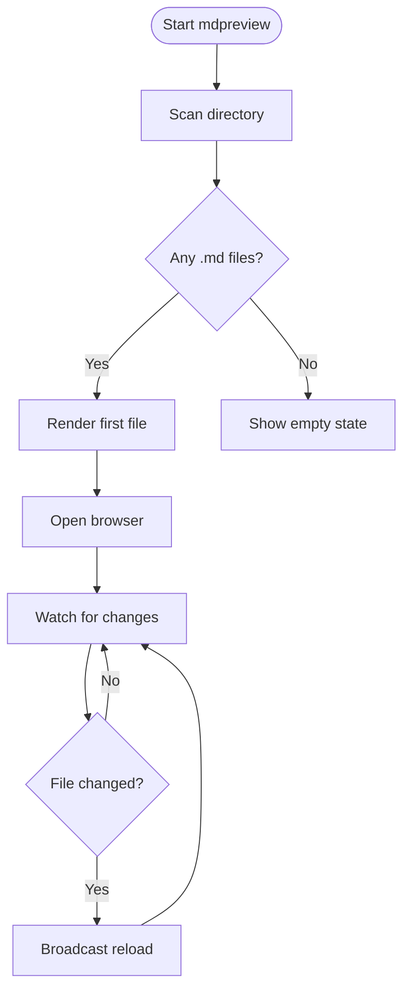
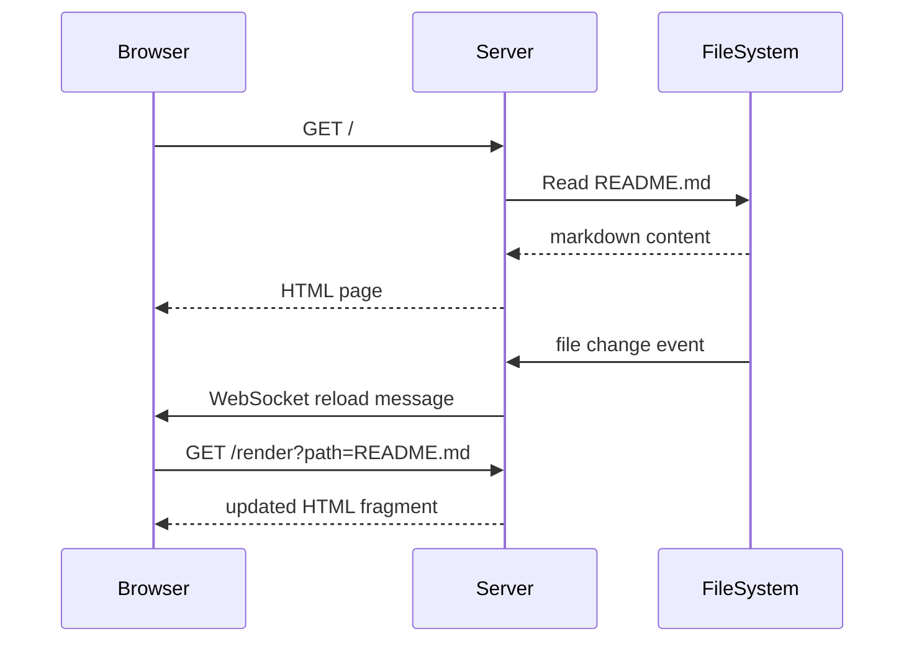

# mdpreview Test Document

A local markdown preview tool that renders files exactly like GitHub.

## Docs

- **[Setup Guide](docs/setup.md)** — installation and usage instructions
- **[API Reference](docs/api.md)** — CLI options and live-reload protocol

## GFM Features

### Table

| Feature | Status | Notes |
|---------|--------|-------|
| Tables | ✅ | With alignment |
| Task lists | ✅ | Checked & unchecked |
| Strikethrough | ✅ | Using `~~` |
| Syntax highlighting | ✅ | Via syntect |
| Autolinks | ✅ | https://github.com |
| Mermaid diagrams | ✅ | Client-side via Mermaid.js |
| Relative links | ✅ | Open inside the previewer |

### Task List

- [x] Set up Rust project
- [x] Implement markdown renderer
- [x] Add live reload via WebSocket
- [x] Add Mermaid diagram rendering
- [x] Handle relative links
- [ ] Publish to crates.io

### Strikethrough

This feature is ~~deprecated~~ working great!

### Code Block

```rust
fn main() {
    println!("Hello from mdpreview!");
    let numbers: Vec<i32> = (1..=5).collect();
    let sum: i32 = numbers.iter().sum();
    println!("Sum: {sum}");
}
```

```bash
cargo install mdpreview
mdpreview .
```

### Autolink

Visit https://github.com for more info.

### Blockquote

> This is a blockquote. It should render with a left border, just like GitHub.

### Footnote

Here is a sentence with a footnote[^1].

[^1]: This is the footnote content.

## Mermaid Diagrams

### Flowchart



### Sequence Diagram


