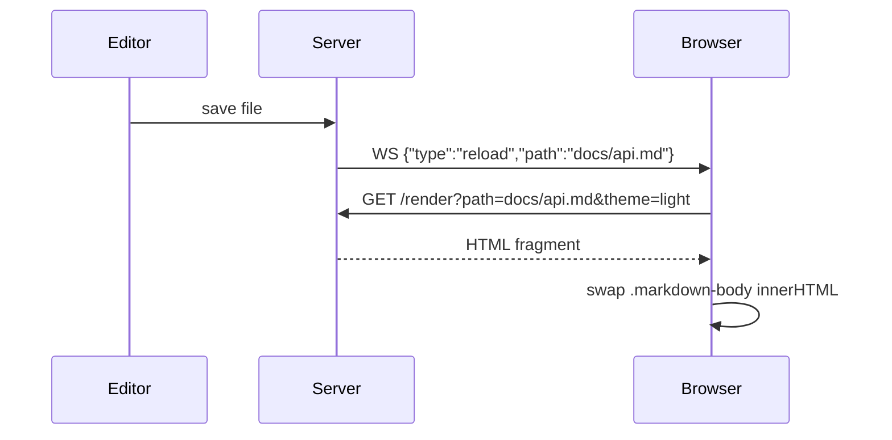

# API Reference

← [Back to Home](../README.md) · [Setup Guide](setup.md)

## CLI Options

```
mdpreview [OPTIONS] [PATH]

Arguments:
  [PATH]  Path to a .md file or directory [default: current directory]

Options:
  -h, --help     Print help
  -V, --version  Print version
```

## HTTP Routes

| Route | Description |
|-------|-------------|
| `GET /` | Renders the default file and returns the full page shell |
| `GET /render?path=…&theme=…` | Returns an HTML fragment for the given file |
| `GET /file?path=…` | Serves raw file bytes (images, binaries) |
| `GET /ws` | WebSocket endpoint for live-reload messages |
| `GET /static/app.js` | Serves the embedded client script |

## Live Reload Protocol

The server exposes a WebSocket endpoint at `/ws`. When any `.md` file changes, the server broadcasts:

```json
{"type": "reload", "path": "docs/api.md"}
```

The client then fetches the updated content from `/render?path=<current-file>` and swaps the content inline without a full page reload.



---

← [Setup Guide](setup.md)
