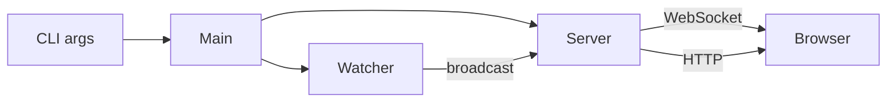

# Setup Guide

← [Back to Home](../README.md) · [API Reference](api.md)

## Installation

```bash
# Via cargo
cargo install mdpreview

# Or build from source
git clone https://github.com/example/mdpreview
cargo build --release
```

## Usage

```bash
# Preview current directory
mdpreview .

# Preview a specific directory
mdpreview ~/my-docs/

# Preview a single file
mdpreview README.md
```

## Requirements

- Rust 1.70+
- Any modern browser

## Architecture Overview



---

Next: [API Reference](api.md)
